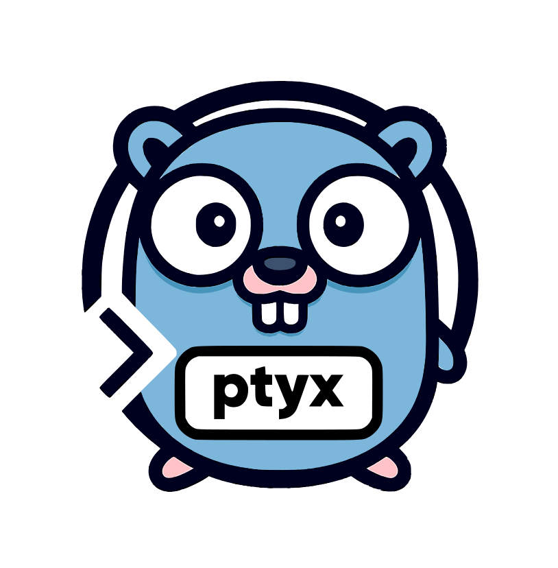

<h1 align="center">ptyx — Cross-Platform PTY/TTY Toolkit</h1>

<p align="center">
  
<p>

<p align="center">
  <a href="https://github.com/KennethanCeyer/ptyx/actions/workflows/ci.yaml"></a>
  <a href="https://go.dev"></a>
  <a href="https://pkg.go.dev/github.com/KennethanCeyer/ptyx"></a>
  <a href="LICENSE"></a>
  
</p>

---

## Overview

`ptyx` is a Go library that provides a simple, cross-platform API for managing pseudo-terminals (PTY) and terminal TTYs.

## Features

- **Cross-Platform Sessions**: Spawn child processes within a PTY on Unix-like systems (Linux, macOS, BSD) and with ConPTY on Windows.
- **Terminal Control**: Manage the local terminal with features like raw mode, size detection, and resize notifications.
- **I/O Multiplexing**: A simple `Mux` utility to bridge the gap between the local console and the PTY session.
- **Zero Dependencies**: No external dependencies beyond the official `golang.org/x/sys` and `golang.org/x/term` packages.

---

## Installation

```bash
go get github.com/KennethanCeyer/ptyx
```

## Run the demos

```bash
# Interactive shell
go run ./cmd/shell

# Local spinner/progress (no PTY)
go run ./cmd/spinner

# Show terminal color support
go run ./cmd/color

# Test ANSI color passthrough by running the color demo in a PTY
go run ./cmd/passthrough

# Raw stdin echo
go run ./cmd/echo

# Capture and parse terminal output as events
go run ./cmd/event

# Send input to a program waiting in a PTY
go run ./cmd/scan

# Run a shell inside a PTY, which itself runs inside a PTY
go run ./cmd/nested

# Resize bridge
go run ./cmd/resize -- /bin/sh

# Run an arbitrary command in a PTY
go run ./cmd/run -- bash -lc "echo hi; read -p 'press:' x; echo done"
```

## Use as a library

```go
package main

import (
  "context"
  "fmt"
  "io"
  "log"
  "os"

  "github.com/KennethanCeyer/ptyx"
)

func runShell() {
  c, err := ptyx.NewConsole()
  if err != nil {
    log.Fatalf("failed to create console: %v", err)
  }
  defer c.Close()
  c.EnableVT()

  st, err := c.MakeRaw()
  if err != nil {
    // On Windows, MakeRaw can fail if not in a standard terminal.
    // We can proceed without it, but the experience will be degraded.
    log.Printf("failed to enter raw mode: %v", err)
  } else {
    defer c.Restore(st)
  }

  w, h := c.Size()
  s, err := ptyx.Spawn(ptyx.SpawnOpts{Prog: "/bin/sh", Cols: w, Rows: h})
  if err != nil {
    log.Fatalf("failed to spawn: %v", err)
  }
  defer s.Close()

  m := ptyx.NewMux()
  if err := m.Start(c, s); err != nil {
    log.Fatalf("failed to start mux: %v", err)
  }
  defer m.Stop()

  go func() {
    for range c.OnResize() {
      if err := s.Resize(c.Size()); err != nil {
        log.Printf("failed to resize: %v", err)
      }
    }
  }()

  if err := s.Wait(); err != nil {
    if exitErr, ok := err.(*ptyx.ExitError); ok {
      fmt.Printf("Process exited with code %d\n", exitErr.ExitCode)
    } else {
      log.Fatalf("wait failed: %v", err)
    }
  }
}
```

### Run a program in PTY

```go
s, _ := ptyx.Spawn(ptyx.SpawnOpts{
  Prog: "bash",
  Args: []string{"-lc", "htop || top"},
  Cols: 120, Rows: 32,
})
defer s.Close()

go io.Copy(os.Stdout, s.PtyReader())
go io.Copy(s.PtyWriter(), os.Stdin)

_ = s.Wait()
```

### API References

```go
type Console interface {
  Size() (int, int)
  MakeRaw() (RawState, error)
  Restore(RawState) error
  EnableVT()
  OnResize() <-chan struct{}
}

type Session interface {
  PtyReader() io.Reader
  PtyWriter() io.Writer
  Resize(cols, rows int) error
  Wait() error
  Kill() error
  Close() error
  Pid() int
}

type SpawnOpts struct {
  Prog string
  Args []string
  Env  []string
  Dir  string
  Cols int
  Rows int
}
```

## Notes

- Unix/macOS/WSL: full PTY support using openpty or /dev/ptmx.
- Windows: Full ConPTY session support, console VT, and resize.
